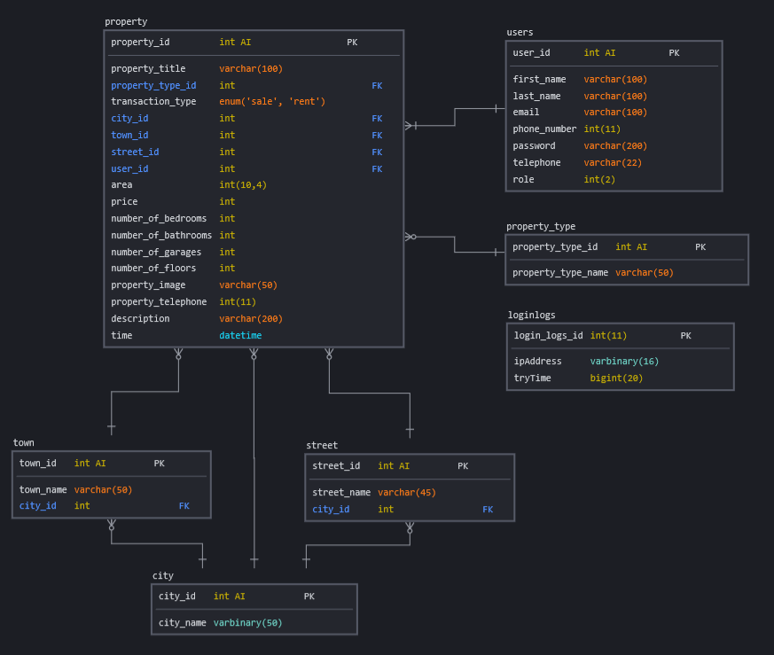

# RealEstate
Wonder Area real estate website for real estate management, offering both client interfaces and an administrative dashboard, streamlining transactions and overall property administration.

## To access the RealEstate website and its admin panel:
### Client Interface:
The client interface of the RealEstate website is hosted at https://wonderarea-realestate.000webhostapp.com/.   
### Admin Panel Dashboard:
The admin panel dashboard of the RealEstate website is also hosted at https://wonderarea-realestate.000webhostapp.com/admin_panel/loginAd.php.  
To log in as an admin, please use the following credentials:  
Email: sakarAdmin@gmail.com  
Password: Pa$$w0rd!  

## Technologies
This website is created using an array of technologies including pure CSS, some Bootstrap, AJAX, JavaScript (JS), PHP, and MySQL. DataTable is being used for the admin dashboard for efficient data visualization and manipulation.

## Here is the ER diagram:

## To set it up with XAMPP, follow the steps below:
1- Place the RealEstate folder inside the 'htdocs' directory of your XAMPP installation.  
2- Import the 'realestatedb.sql' database file into your phpMyAdmin. You can find this file in the root of the project folder.  
3- Navigate to the RealEstate/includes/ directory and locate the 'conn.php' file. This file establishes a connection with the MySQL database. Open this file and ensure the database username and password are correctly       configured to match your database credentials.  
4- Similarly, within the RealEstate/admin_panel/includes directory, you'll find another 'conn.php' file. Ensure that this file is also appropriately configured with your database credentials.  

<b>Note: Before moving further ensure that you've imported the 'realEstateDb.sql' into your phpMyAdmin to set up the database correctly.</b>  

## To access the platform:
<b>As an Admin:</b> You have access to the administrative dashboard where you can manage user accounts, handle site configuration, and perform other administrative tasks. To log in as an admin, head to http://localhost/RealEstate/admin_panel/loginAd.php and use these credentials:  
Email: sakarAdmin@gmail.com   
Password: Pa$$w0rd!  

<b>As an Regular User:</b> You can browse property listings, make inquiries, and access other features tailored to the client experience. To sign up or log in as a regular user, visit the main page at http://localhost/RealEstate/. If you'd like a quick start, you can use a pre-existing regular user account. Here are the credentials:  
Email: sakarUser@gmail.com  
Password: Pa$$w0rd!   

### Additional Notes:
1- Creation of new admin accounts can only be done by existing admins. Once logged in as admin, select 'Register admin' from the profile dropdown on the upper right side of the admin panel.  
2- Be aware that there's a limit of 3 failed login attempts every 5 minutes for admin users. If you exceed this limit, your IP will be blocked for 5 minutes.

### Log in detail examples:
#### Admin:
Email: sakarAdmin@gmail.com  
Password: Pa$$w0rd!  

#### Regular User:
Email: sakarUser@gmail.com  
Password: Pa$$w0rd!  
All other accounts that are created utilize the same password: Pa$$w0rd!
